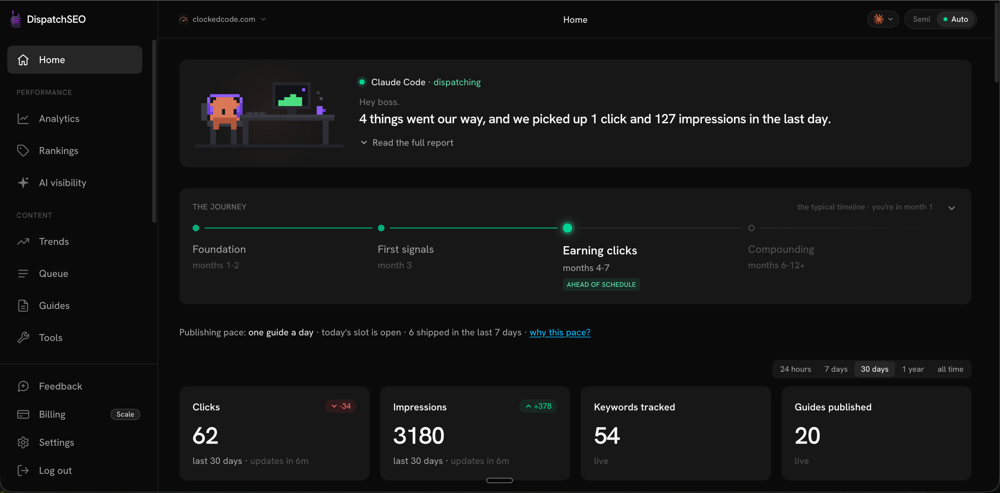

<p align="center">
  <a href="https://dispatchseo.com">
    
  </a>
</p>

<h1 align="center">DispatchSEO</h1>

<p align="center">
  <a href="LICENSE"></a>
  <a href="docs/AGENTS.md"></a>
  <a href="https://dispatchseo.com/docs#choose-your-install"></a>
  <a href="https://dispatchseo.com/discord"></a>
</p>

<div align="center">
  <strong>
  <h2>Turn your AI agent into your SEO manager</h2><br />
  <a href="https://dispatchseo.com">DispatchSEO</a>: an open-source alternative to SEObot and Outrank.<br /><br />
  </strong>
  Works today with <b>Claude Code</b>, <b>Codex</b>, and <b>Cursor</b> - all first-class, including the unattended overnight builder.<br /><br />
  Other SEO tools learn about your product by crawling your homepage. Your agent already knows it,<br />so DispatchSEO gives that agent the missing half: keyword research, content that ships as pull requests, and rank tracking.
</div>

<div align="center">
  <br />
  
  &nbsp;
  
  &nbsp;
  
  &nbsp;
  
  &nbsp;
  
  &nbsp;
  
  &nbsp;
  
  &nbsp;
  
</div>

<p align="center">
  <br />
  <a href="https://dispatchseo.com/docs#choose-your-install"></a>
  &nbsp;
  <a href="https://dispatchseo.com/docs"></a>
  &nbsp;
  <a href="https://www.youtube.com/watch?v=1gCXPxPqfy0"></a>
</p>

<p align="center">
  <a href="https://dispatchseo.com">Website</a>
  &nbsp;&middot;&nbsp;
  <a href="https://dispatchseo.com/discord">Discord</a>
  &nbsp;&middot;&nbsp;
  <a href="https://github.com/NeoZi12/dispatchseo/discussions">Discussions</a>
  &nbsp;&middot;&nbsp;
  <a href="https://dispatchseo.com">Hosted version</a>
</p>

<p align="center"><i>Self-hosted has zero feature limitations. Everything the paid<br />cloud does, this repo does today, in your own accounts, at $0.</i></p>

<p align="center">
  <a href="https://www.youtube.com/watch?v=1gCXPxPqfy0">
    
  </a>
  <br>
  <sub>▶ Watch the preview</sub>
</p>

<br />

## ⚡ How it works

1. **Your agent researches.** Claude Code, Codex, or Cursor connects to DispatchSEO over MCP,
   reads the served playbook, and mines keywords from your Search Console
   data, Google Autocomplete, and what it already knows about your product.
   Ideas land in a queue with the reasoning attached.
2. **You approve, or don't.** Each idea is a card on the dashboard: the
   keyword, why it's winnable, the angle. Approve, reject, or reorder.
   Prefer full autopilot? Flip on auto mode and skip the queue entirely.
3. **The pipeline builds.** Every morning a scheduled job picks the oldest
   approved idea and builds it into a real pull request against your site's
   repo: a guide or a small free tool, checked against the live SERP and run
   through a sameness reviewer so page twelve doesn't read like page three.
4. **It tracks what happened.** Daily rank checks, hourly Search Console
   snapshots, index verification, and a journey view that tells you which
   SEO stage you're actually in. When a scheduled job breaks, you get a red
   banner and an email instead of silence.

The backend is deliberately boring: state, scheduling, and an approval gate.
The thinking happens in your agent, where your product knowledge already
lives.

<table>
  <tr>
    <td colspan="2"></td>
  </tr>
  <tr>
    <td></td>
    <td></td>
  </tr>
  <tr>
    <td></td>
    <td></td>
  </tr>
</table>

## 🤖 Which coding agent

DispatchSEO talks to your agent over MCP, so "which agent" is a real question
with a real answer — including the parts that aren't finished yet.

| Agent | Connect + every tool | Unattended overnight builder |
|---|---|---|
| **Claude Code** | ✅ | ✅ |
| **Codex** | ✅ | ✅ |
| **Cursor** | ✅ one-paste connect, all 61 tools | ✅ (needs a paid Cursor plan) |
| Gemini CLI · Copilot · any MCP client | ✅ | ❌ |

Connecting is one paste and gets you the whole tool set: research, the queue,
approvals, backlinks, reports, and building a guide when you ask for one. The
overnight builder is the separate thing — scheduled jobs that run an agent with
nobody watching — and all three do that. Every workflow carries every agent
and asks the dashboard which to run, so switching agent takes effect on the
next scheduled run with no repo change.

The honest difference is who pays: Claude Code runs on a subscription you
already have, Cursor runs on a paid Cursor plan's API key, and Codex is
metered by OpenAI per run.

[docs/AGENTS.md](docs/AGENTS.md) has the details, the support tiers, and how to
add an agent.

## ✅ What you need before you start

- **Your site's source in a GitHub repo.** The pipeline ships content as pull
  requests, so git-based sites only - WordPress won't work.
- **A coding agent.** Your agent is the engine. Claude Code runs on the Claude
  subscription you already pay for; Codex and Cursor do everything Claude Code
  does here, including the overnight builder — Codex is metered by OpenAI per
  run, and Cursor's builder key needs a paid Cursor plan. See the table above.
- **A machine with Docker** (~1 GB RAM). A laptop works for a test drive, but
  a machine that stays on is much better for daily use - a $5 VPS, a Raspberry
  Pi, a desktop that never sleeps. Schedules only run while the machine is awake.
- **Google Search Console access** to your site.

That's the whole list. No API keys to buy, and no account on our side.

## 📖 Documentation

Everything is at **[dispatchseo.com/docs](https://dispatchseo.com/docs)** - every
page, every setting, every tool.

| | |
| --- | --- |
| **New here** | [What DispatchSEO is](https://dispatchseo.com/docs/introduction) · [How it works](https://dispatchseo.com/docs/how-it-works) · [Cloud or self-hosted](https://dispatchseo.com/docs/choosing-how-to-run-it) |
| **Install** | [Quickstart](https://dispatchseo.com/docs#choose-your-install) - your own computer, a VPS, or from source |
| **Set up** | [Install Claude Code](https://dispatchseo.com/docs/install-claude-code) · [Install Codex](https://dispatchseo.com/docs/install-codex) · [Install Cursor](https://dispatchseo.com/docs/install-cursor) · [The setup wizard](https://dispatchseo.com/docs/setup-wizard) · [Search Console](https://dispatchseo.com/docs/search-console) · [Keyword data](https://dispatchseo.com/docs/keyword-data) · [Publishing](https://dispatchseo.com/docs/publishing) · [Connect your site](https://dispatchseo.com/docs/connect-your-site) |
| **Use it** | [Day to day](https://dispatchseo.com/docs/day-to-day) · [The dashboard](https://dispatchseo.com/docs/dashboard) · [Automations](https://dispatchseo.com/docs/automations) · [Agent commands](https://dispatchseo.com/docs/agent-commands) |
| **Reference** | [Concepts](https://dispatchseo.com/docs/concepts) · [MCP tools](https://dispatchseo.com/docs/mcp-tools) · [Environment variables](https://dispatchseo.com/docs/environment-variables) · [Schedules](https://dispatchseo.com/docs/schedules) · [Architecture](https://dispatchseo.com/docs/architecture) |
| **Help** | [Troubleshooting](https://dispatchseo.com/docs/troubleshooting) · [Common questions](https://dispatchseo.com/docs/faq) · [Security](https://dispatchseo.com/docs/security) · [Upgrading](https://dispatchseo.com/docs/upgrading) |

**Pointing an agent at this?** Add `.md` to any docs URL for clean markdown, or
fetch the entire documentation set in one request:
**[llms-full.txt](https://dispatchseo.com/llms-full.txt)**. There's an index at
[llms.txt](https://dispatchseo.com/llms.txt) and a [SKILL.md](SKILL.md) that
walks an agent through connecting a site.

**Stuck during setup?** The
[troubleshooting page](https://dispatchseo.com/docs/troubleshooting) covers the
errors people actually hit. If yours isn't there, ask in the
[Discord](https://dispatchseo.com/discord) or in
[Discussions](https://github.com/NeoZi12/dispatchseo/discussions) - questions get
answered and usually turn into a docs fix.

## 🗓️ Using it day to day

Once the wizard is done, the loop is small on purpose:

| When | You do | It does |
| --- | --- | --- |
| Once a week, 5 minutes | Open the dashboard, work through the queue - approve, reject, reorder | Refills the queue with researched ideas and the reasoning behind each one |
| Every morning | Nothing | Builds the oldest approved idea into a pull request on your repo |
| When a PR lands | Review and merge (or let auto-merge do it) | Logs the page, requests indexing, starts tracking its keyword |
| Whenever you want | Ask your agent: *"research keywords for me"*, *"what should I write next?"*, *"how are we ranking?"* | Answers from live data over MCP - same state the dashboard shows |

The dashboard's Home page always names the next action, so you don't have to work
out what to do when you open it.

## 🧰 What's in the box

- **MCP server** with [the full tool set](https://dispatchseo.com/docs/mcp-tools): the
  queue, keywords, rankings, pages, GSC stats, backlink prospects, trend
  topics, site profile. Anything the dashboard can do, your agent can do over
  MCP; parity between the two is a hard rule in this codebase.
- **Trend radar**: scan for rising topics in your niche, expand a topic into
  concrete guide angles, and queue the good ones.
- **Guide and tool builders**: guides publish at most one per day, flat and
  permanent (so a queue of thirty approved ideas doesn't become thirty posts
  in a week); free-tool ideas build on approval.
- **Backlink playbook**: a prospect list prefilled with your product's copy,
  tracked per submission.
- **Multi-site**: one deployment manages any number of sites. Each project
  gets its own MCP token, its own data, its own settings.
- **A password-gated dashboard** for the one human in the loop.

## 💵 What it costs to run

Nothing, unless you want paid data. The tiers stack:

| Tier | Price | What you get |
| --- | --- | --- |
| Search Console only | **$0** | Rankings from GSC, keyword ideas from Autocomplete plus your own impression data |
| + SerpApi free key | **$0** | Live SERP checks, real positions weekly (250 free searches/month) |
| + DataForSEO | pay per call | Search volume, keyword difficulty, domain rating |

Free mode finds keywords you can win. Paid mode also knows which ones are
worth winning.

## ☁️ Cloud version

There's a hosted version for people who'd rather not run a machine: we host it,
bundle the SERP + volume data into one bill, and replace the Google
service-account ritual with one click. It's at
[dispatchseo.com](https://dispatchseo.com). Self-hosting stays feature-complete
either way - the cloud sells convenience, not capability.

## 🧑‍💻 Developing from source

```bash
git clone https://github.com/NeoZi12/dispatchseo
cd dispatchseo
pnpm install
cp .env.local.example .env.local
pnpm dev
```

This is the contributor path, not the way to self-host - that's the one-command
Docker install behind the button at the top. Fill in `.env.local` (Supabase +
the three secrets) before starting, then open the dashboard on
**localhost:3000**.

`pnpm build` is the typecheck - run it before opening a PR. There is no
separate lint or test setup.

## 🏗️ Architecture, briefly

Next.js App Router, Postgres for state (a bundled container when self-hosted,
Supabase in the cloud version), `mcp-handler` for the MCP server at `/api/mcp`.
Schedules and builds run in-stack (cron + builder containers) or on GitHub
Actions. One deployment is multi-tenant: the MCP bearer token selects the
project, crons loop over all projects, the dashboard switches with a cookie.

[Architecture](https://dispatchseo.com/docs/architecture) covers this properly.
[CLAUDE.md](CLAUDE.md) has the full conventions; it's written for agents, which
turns out to make it decent documentation for people.

## 🤝 Contributing

Issues before PRs, and you must understand every line you submit, including the
AI-assisted ones. Details in [CONTRIBUTING.md](CONTRIBUTING.md). Questions go to
[Discussions](https://github.com/NeoZi12/dispatchseo/discussions) or the
[Discord](https://dispatchseo.com/discord); vulnerabilities go through
[private reporting](SECURITY.md).

## 📄 License

[AGPL-3.0](LICENSE). Use it, self-host it, fork it. If you run a modified
version as a service, share the source. That's the whole deal.

---

<p align="center">
  <sub>Built by <a href="https://github.com/NeoZi12">NeoZi12</a> · If DispatchSEO is useful to you, a ⭐ helps other people find it.</sub>
</p>
